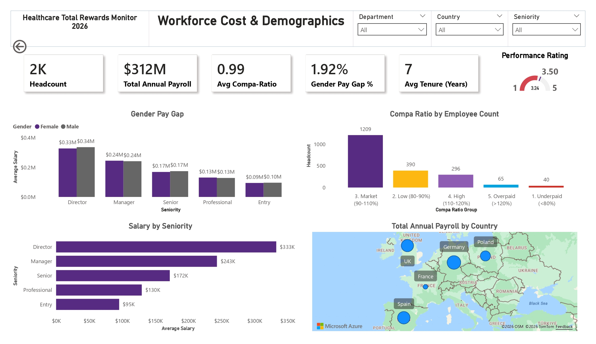
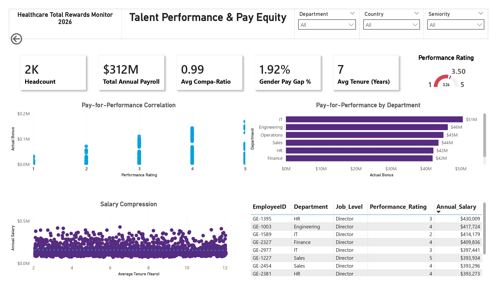
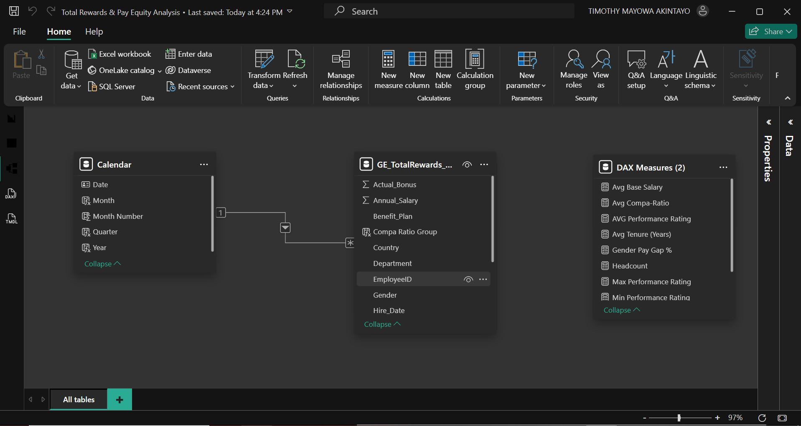
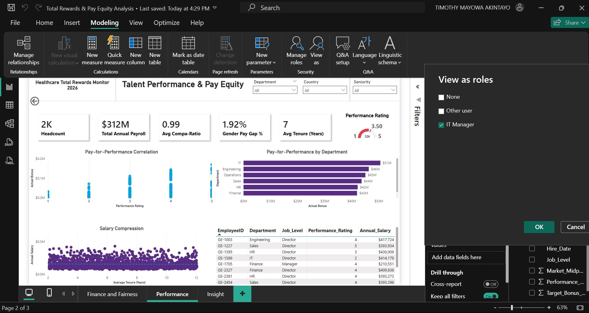
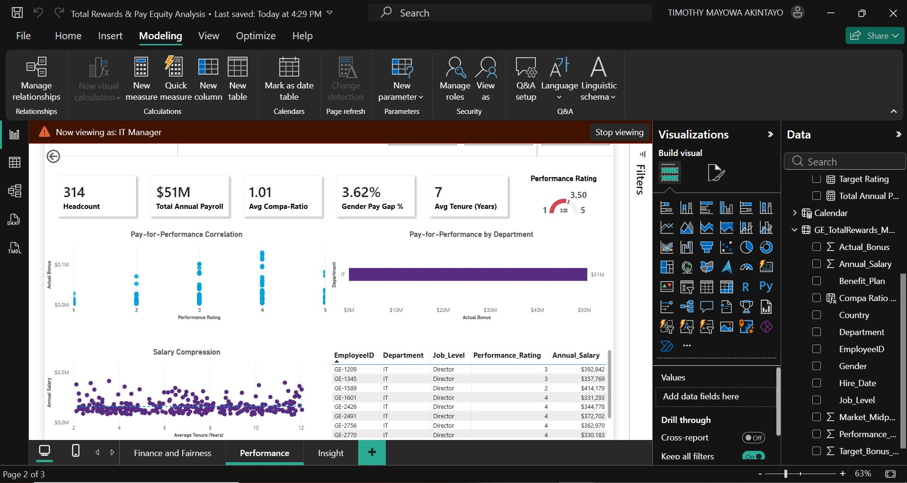

# $312M Payroll Audit: The 7-Year Trap


## Impact at a Glance
* Retention risk identified from systematic entry-level tenure traps.
* EU Pay Transparency compliance validated (1.92% gap vs. 5% regulatory threshold).
* Performance-pay disconnect exposed: Company's 3rd-highest earner scored bottom-tier performance rating.
* 40 employees flagged as underpaid flight risks (<80% market rate).

**Tools Used:** Power BI, Data Cleaning via Power Query, DAX.

---

## Business Problem
A 2,000-person European workforce with a $312M payroll was facing a compliance deadline: the EU Pay Transparency Directive goes into full effect in 2026, requiring public disclosure of gender pay gaps.
But compliance wasn't the real problem.
The real problems were:
* Tenure data: Employees stuck at "Entry Level" for 7+ years. The company had experienced professionals artificially capped in junior salary bands. 
* An IT Director earning $414K annually with a performance rating of 2. The company was not paying for performance. 

I was brought in to audit the entire compensation structure before regulators, employees, or the public did it for the company.

---

**Key Business Questions:**
* Is the organization compliant with the **5% Gender Pay Gap** threshold?
* Are our "Top Earners" actually our "Top Performers"?
* Are we experiencing salary compression across seniority levels?

---

## My Approach
I built a compensation analytics model that went beyond simple averages. Using Power Query for data cleaning and DAX for analysis, I created a framework that could:

* Isolate true pay inequity by comparing men and women within the same job level (not just globally).
* Map tenure against job architecture to find promotion bottlenecks.
* Correlate performance ratings with actual compensation if employees were getting paid based on their performance.

---

## Critical Findings
1. The 7-Year Trap: When "Entry Level" Becomes a Life Sentence:
* **What I found:** Employees with 7+ years of tenure still classified as "Entry Level".
* **The human cost:** Imagine working somewhere for seven years, mastering your role, training new hires, and watching those new hires get promoted past you because you're trapped in a job architecture that doesn't recognize your growth.
* **The business cost:** Every one of these employees is a retention bomb. The moment a recruiter reaches out on LinkedIn with a "Senior" title and a 30% raise, they're gone, and they'll take their knowledge with them, which is cost disadvantageous for the company when you factor in recruitment process, cost of recruitment and projected time it will take for new hires to attain their level of expertise.

* The recommendation:
	- **Immediate Job Architecture Audit:** Re-level every employee with 5+ years at Entry Level.
	- **Budget requirement:** Do a budget estimate of how much it would cost to increase these employees' salary.

2. Compliance Check: We're Safe (For Now)
* **What I found:** Unadjusted gender pay gap of 1.92% which is well below the 5% EU threshold that triggers mandatory corrective action.
* **Why this matters:** Poland's pay transparency laws require public disclosure starting in 2026. If we drift above 5%, we're not just non-compliant, we would become non-compliant, which will then become a recruitment disaster, and potential loss of current and potential hires.
* **The hidden risk:** The global average hides localized problems. When I analyzed by job level, and filtered by departments, the gender gap became visible across different levels. Departments where women earn higher than men. Specifically, in sales and operations women earned higher than men.
* **The recommendation:** Trigger a proactive salary adjustments for the director level and entry level salaries globally where there is disparity (salary gaps), and investigate departmental and job level disparity for necessary salary adjustments to ensure departmental and job level salary equity.


3. The **$414K** Question: Are We Paying for Performance or Seniority?
* **What I found:** The company's 3rd-highest earner, an IT Director commanding $414K had a performance rating of 2 out of 5, which is below the global performance average of 3.24. Meanwhile, high-performers in Sales and Operations were less.
* **Why this matters:** If the company's top earners aren't its top performers, it means the compensation model is broken. This implies the following:
	- Rewarding the wrong people (budget misallocation)
	- Paying for tenure instead of results.
	
	  
     *(Snapshot of the Top earners on the right)*
  

* **The recommendation:**
	- Do a 5-year performance history review of this manager's performance to see if this has been a trend or this director was once a high performer and their performance has declined over time. This will help to examine if this has to do with employee distress role mismatch, if they became director through a recent promotion, experiencing burnout, or they require Employee Assistance Program (EAP).
	- Cross-referencing with their 5-year performance history will also help to see if this is an anomaly. If yes, then there must be swift annual salary reallocation, and if it is an anomaly, then the performance management system should be reviewed.

4. The Flight Risk List: 40 Employees We're About to Lose
* **What I found:** Using Compa-Ratio analysis (employee salary vs. market midpoint), 1209 (60%) of the employees fall within the market midpoint of (90-110%), while 40 employees (2% of workforce) earn <80% of market rate. These employees are likely to leave if nothing is done about their salary.
* **Recommendation**: Review the salaries of this underpaid employees, before they leave. This is because losing these employees implies knowledge loss, project delays, and team disruption. If they are high performing employees, then their salary should be increased, and if low performing employees, then no action is needed as regards their salary.

## Tech Stack & Methodology
* **Data Modeling:** Designed a schema to handle HR data, and enabled Row-Level Security (RLS) simulation by Department.
* **Statistical Analysis:** Used DAX iterators (`SUMX`, `AVERAGEX`) to calculate **Adjusted Pay Gaps** comparing men and women *within* the same job level rather than globally.
* **Visualization:** Scatter plots to visualize the correlation between Performance Rating and Salary.

 
     *(Snapshot of the star schema)*
---

## Code Highlight: Unadjusted Gender Pay Gap

```dax
Adjusted Gender Pay Gap = 
VAR Avg_Male = CALCULATE(AVERAGE(Fact_Pay[Salary]), Dim_Emp[Gender] = "Male")
VAR Avg_Female = CALCULATE(AVERAGE(Fact_Pay[Salary]), Dim_Emp[Gender] = "Female")
RETURN
DIVIDE( (Avg_Male - Avg_Female), Avg_Male, 0 )
```

## Row-Level Security (RLS) Filter
I implemented a Row-Level Security (RLS) Filter on the department. A specific role was created for the IT manager this enables every department head to be able to view only information for their respective departments.

 

 
*(Snapshot: Row Level Security filter and output to the report)*


## 📁 Project Structure
Healthcare-Total-Rewards-Analytics/
```text
│
├── dashboards/
│   └── Total Rewards & Pay Equity Analysis.pbix
│
├── calculations/
│   └── dax_measures.md
│
├── data/
│   └── Total Rewards & Pay Equity Analysis.csv
│
├── docs/
│   └── Total Rewards & Pay Equity Analysis.pdf
│
├── images/
│   ├── pay_equity_analysis_banner.jpg
│   ├── pay_for_performance.jpg
│   ├── data_model_hr.png
│   ├── insights_recommendation.jpg
│   ├── rls_demo.png
│   └── rls_demo_output.png
│
└── README.md
```
---

## Note
Data anonymized per GDPR requirements.

